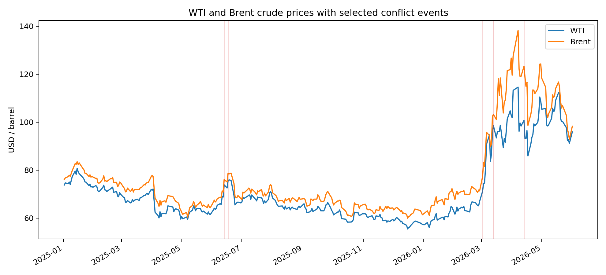
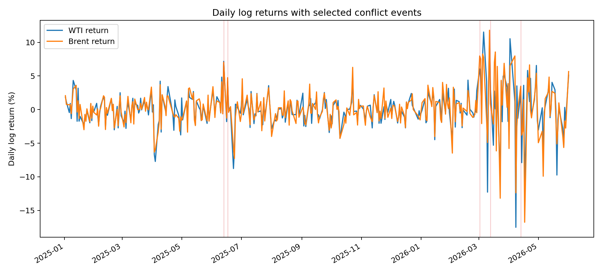
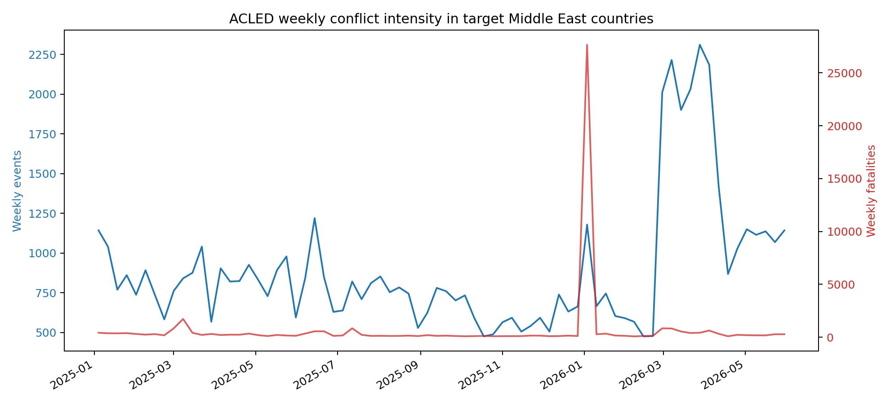
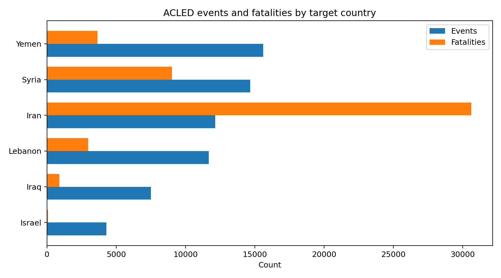

# T3 中东冲突对国际油价冲击：事件研究法与回归分析

## 摘要

本文围绕“中东冲突升级是否会对国际油价造成统计显著冲击”这一问题，以 2025-2026 年伊以冲突及其外溢事件为研究对象，使用 WTI 与 Brent 日度油价构造对数收益率，并选取 7 个关键事件进行事件研究和中断时间序列分析。研究的核心不是简单描述油价涨跌，而是把每个事件前后的价格变化拆分为正常波动与异常冲击，进一步检验哪些事件的影响具有统计显著性。

实证样本覆盖 2024-06-04 至 2026-06-01，主事件窗口采用 `[0,+3]`。在 10 个资产-事件组合中，有 4 个组合达到 10% 或更高显著性。报告同时给出 Durbin-Watson、Breusch-Pagan、Newey-West 修正和结构断点近似结果，以检查回归结论是否受到残差自相关、异方差或结构变化的影响。

## 研究背景与问题提出

原油价格对地缘政治风险高度敏感。中东地区既是全球重要产油区，也是关键航运通道所在地，一旦军事冲突影响石油设施、出口预期或霍尔木兹海峡等运输瓶颈，市场往往会迅速把风险溢价计入期货和现货价格。但是，油价本身也会受到库存、美元、OPEC 预期、宏观需求和金融市场风险偏好的影响，因此“冲突发生后油价上涨或下跌”并不等同于“冲突造成了统计显著冲击”。

ACLED 中东汇总数据进一步显示，在 2025-01-01 至 2026-06-01 期间，目标国家合计记录 65,938 起事件和 47,285 人死亡。按事件数看，最高的国家是 Yemen，共 15,616 起；周度事件峰值出现在 2026-03-28 所在周，该周目标国家合计 2,311 起事件。

本作业采用事件研究法和回归分析来回答三个问题：第一，每次重大事件后 WTI 与 Brent 的异常收益有多大；第二，哪些事件的累计异常收益 CAR 在统计意义上显著；第三，当多个事件密集发生时，能否通过中断时间序列模型分离单次冲击的即时水平变化和后续趋势变化。

## 数据来源与变量解释

### 数据来源与处理过程

- 油价样本：用于建模的价格数据从 2024-06-04 开始，以保证早期事件也有足够的估计窗口；主报告关注 2025-01-01 至 2026-06-01 的事件样本。
- WTI 与 Brent 日度价格采用 FRED 口径的日度原油价格数据，并统一到共同交易日。
- 事件样本由人工核验的中东冲突升级事件构成，并预留 ACLED 与 GDELT 指标作为事件强度补充。
- ACLED 汇总数据来自中东地区周度聚合表，粒度为“周-国家-一级行政区-事件类型/子类型”。它可以衡量事件发生周的区域冲突强度，但不包含逐条事件的参与方和文字叙述，因此本报告将其作为背景验证数据，而不直接替代人工核验事件清单。
- 对油价先按日期合并，再剔除缺失值，并计算日对数收益率。对数收益率比简单涨跌幅更适合时间序列建模，因为连续多期收益可以近似相加。

### 单项数据解释

- `wti`：West Texas Intermediate，美国轻质低硫原油价格，报告样本内价格区间为 55.44 至 114.58 美元/桶。WTI 对北美供需、库存和金融交易预期较敏感。
- `brent`：Brent 原油价格，报告样本内价格区间为 59.93 至 138.21 美元/桶。Brent 更常被视为国际海运原油基准，对中东供应风险的反应通常更直接。
- `r_wti`、`r_brent`：WTI 与 Brent 的日对数收益率，计算公式为 `r_t = ln(P_t) - ln(P_{t-1})`。本报告把收益率作为被解释变量，而不是直接回归价格水平，以降低趋势和量纲问题。
- `event_date`：事件实际发生日期。若事件发生在周末或非交易日，油价无法在当天交易，因此不能直接用于收益率窗口。
- `trading_date`：事件映射到的第一个可交易日，是事件研究和 ITS 的实际冲击日期。
- `acled_count`：同日 ACLED 冲突事件数量，反映事件密度。当前为可插拔字段，取得 ACLED 导出后可自动替换。
- `fatalities`：ACLED 记录的死亡人数，用来近似事件严重程度。该变量可能存在低报或统计口径差异，因此只作为辅助权重。
- `gdelt_goldstein`：GDELT 的事件方向和强度分数，负值通常代表冲突、威胁或对抗性事件，绝对值越大表示事件强度越高。
- `mentions`：GDELT 或新闻数据中同日相关报道数量，用来刻画市场可观察的信息强度。
- `event_score`：事件筛选得分，由事件密度、死亡数、GoldsteinScale 绝对值、新闻提及量和局部油价波动共同构成，用于对候选事件排序。
- `ACLED EVENTS/FATALITIES`：ACLED 汇总表中的周度事件数与死亡人数。本报告用它说明候选事件发生周的地区冲突强度，而不把它当作逐事件记录。

## 事件选择与样本构造

事件研究法要求事件日期尽可能清晰，并且事件窗口之间不能过度重叠。本报告先保留 2025-2026 年与伊朗、以色列及周边航运风险相关的候选事件，再根据事件得分和交易日映射结果选择 7 个事件。对于相距较近的事件，后续多事件 ITS 会共同纳入多个 post 项，以减少单事件窗口互相污染。

| event_id   | event_date   | trading_date   | title                                              |   event_score |   rank |
|:-----------|:-------------|:---------------|:---------------------------------------------------|--------------:|-------:|
| E1         | 2025-06-13   | 2025-06-13     | 以色列对伊朗核设施和军事目标发动大规模打击         |        53.076 |      1 |
| E3         | 2026-02-28   | 2026-03-02     | 美国与以色列对伊朗发动联合打击并引发地区性报复     |        52.554 |      2 |
| E5         | 2026-04-13   | 2026-04-13     | 美国宣布对伊朗实施海上封锁并强化霍尔木兹海峡风险   |        49.272 |      3 |
| E4         | 2026-03-13   | 2026-03-13     | 美国打击伊朗哈尔克岛军事目标并威胁石油出口基础设施 |        48.972 |      4 |
| E2         | 2025-06-17   | 2025-06-17     | 伊以导弹与空袭交锋持续并扩大市场风险溢价           |        45.313 |      5 |

下表把 7 个油价事件映射到 ACLED 汇总数据中的对应周，用于判断事件发生时区域冲突强度是否同步升高：

| event_id   | event_date   | acled_week   |   week_events |   week_fatalities | top_country_in_week   |   top_country_events |
|:-----------|:-------------|:-------------|--------------:|------------------:|:----------------------|---------------------:|
| E1         | 2025-06-13   | 2025-06-14   |          1220 |               551 | Iran                  |                  430 |
| E3         | 2026-02-28   | 2026-02-28   |          2012 |               835 | Iran                  |                  765 |
| E5         | 2026-04-13   | 2026-04-18   |           868 |                83 | Iran                  |                  282 |
| E4         | 2026-03-13   | 2026-03-14   |          1901 |               533 | Iran                  |                  734 |
| E2         | 2025-06-17   | 2025-06-21   |           848 |               550 | Yemen                 |                  245 |

## 统计方法链

### 1. 事件窗口与 CAR 计算

事件研究法的出发点是比较“事件发生后的实际收益”与“如果事件没有发生，本应出现的正常收益”。设资产 `i` 在日期 `t` 的收益率为 `R_{i,t}`，正常收益为 `E(R_{i,t})`，则异常收益为：

`AR_{i,t} = R_{i,t} - E(R_{i,t})`

在事件窗口 `[τ_1, τ_2]` 内，累计异常收益为：

`CAR_i(τ_1, τ_2) = Σ_{t=τ_1}^{τ_2} AR_{i,t}`

本报告使用 `[-1,+1]`、`[0,+3]` 和 `[0,+5]` 三个窗口。`[-1,+1]` 用于捕捉提前交易或时区差异，`[0,+3]` 作为主窗口，`[0,+5]` 用于观察冲击是否延续。

### 2. 正常收益模型：市场模型

为了估计正常收益，本报告采用市场模型。由于当前不强制引入额外商品指数，WTI 与 Brent 互为市场参照：估计 WTI 时用 Brent 收益作为市场因子，估计 Brent 时用 WTI 收益作为市场因子。模型为：

`R_{i,t} = α_i + β_i R_{m,t} + ε_{i,t}`

其中估计窗口为事件日前 120 个交易日，并跳过事件日前 21 个交易日，避免事件预期污染正常收益估计。若早期事件样本不足，则至少保留 60 个交易日。

### 3. CAR 显著性 t 检验

CAR 的显著性检验考察累计异常收益是否显著偏离 0。若事件窗口长度为 `L`，估计窗口残差标准差为 `σ̂_AR`，检验统计量写作：

`t = CAR / (σ̂_AR √L)`

原假设为 `H_0: CAR = 0`，即事件没有造成异常收益；备择假设为 `H_1: CAR ≠ 0`。报告中 `* / ** / ***` 分别代表 10%、5% 和 1% 显著性。

### 4. 中断时间序列 ITS

事件研究关注窗口内的累计冲击，ITS 则进一步区分事件后的即时水平变化和趋势变化。局部 ITS 模型为：

`r_t = β_0 + β_1 time_t + β_2 post_t + β_3 time_after_t + ε_t`

`β_2` 表示事件发生后收益率水平的即时跳变，`β_3` 表示事件后趋势斜率的变化。多事件 ITS 在同一模型中放入多个事件的 `post` 与 `time_after` 变量，用来在事件密集时期分离不同事件的影响。

### 5. 残差诊断：DW 与 BP

Durbin-Watson 统计量用于检查残差一阶自相关，数值接近 2 通常表示自相关不明显；明显小于 2 往往提示正自相关。Breusch-Pagan 检验用于检查异方差，若 p 值较小，则说明残差方差可能随解释变量变化，常规 OLS 标准误可能不稳健。

### 6. Newey-West 修正

油价收益率可能存在短期自相关和条件异方差。Newey-West 标准误在估计系数不变的前提下修正协方差矩阵，使回归推断对异方差和自相关更稳健。本报告对 ITS 的水平冲击项报告 Newey-West 修正后的标准误和 p 值。

### 7. Bai-Perron 结构断点思想

Bai-Perron 方法的目标是在未知断点位置下寻找时间序列结构发生变化的日期。当前实现不强制安装专用包，因此采用单断点分段线性 RSS/BIC 网格搜索作为近似：对每个候选断点分别拟合断点前后两段线性趋势，选择 BIC 最优的日期。若最优断点距离候选冲突事件不超过 5 天，则记为 `break_support=True`，作为事件冲击改变油价结构的辅助证据。

## 实证结果与解释

主表使用 `[0,+3]` 事件窗口；`* / ** / ***` 分别表示 10% / 5% / 1% 显著。

| asset   | event_id   | event_date   |   CAR_pct |   t_stat |   p_value | sig_level   |   rank |
|:--------|:-----------|:-------------|----------:|---------:|----------:|:------------|-------:|
| Brent   | E4         | 2026-03-13   |    13.552 |    7.036 |    0      | ***         |      1 |
| Brent   | E2         | 2025-06-17   |     2.859 |    1.651 |    0.1015 | n.s.        |      2 |
| Brent   | E3         | 2026-02-28   |     2.474 |    1.419 |    0.1585 | n.s.        |      3 |
| Brent   | E1         | 2025-06-13   |     2.265 |    1.313 |    0.1918 | n.s.        |      4 |
| Brent   | E5         | 2026-04-13   |    -0.711 |   -0.283 |    0.7773 | n.s.        |      5 |
| WTI     | E4         | 2026-03-13   |   -10.198 |   -5.989 |    0      | ***         |      1 |
| WTI     | E2         | 2025-06-17   |    -3.681 |   -1.963 |    0.052  | *           |      2 |
| WTI     | E3         | 2026-02-28   |     2.567 |    1.684 |    0.0948 | *           |      3 |
| WTI     | E1         | 2025-06-13   |     0.214 |    0.114 |    0.9092 | n.s.        |      4 |
| WTI     | E5         | 2026-04-13   |    -0.165 |   -0.062 |    0.9506 | n.s.        |      5 |

主窗口下显著事件数量为 4 / 10（按资产-事件组合计）。从资产维度看：

- WTI：主窗口 `[0,+3]` 下绝对冲击最大的事件是 E4，CAR=-10.20%，t=-5.99，p=<0.0001；统计显著性最强的事件是 E4，p=<0.0001，显著性标记为 `***`。
- Brent：主窗口 `[0,+3]` 下绝对冲击最大的事件是 E4，CAR=13.55%，t=7.04，p=<0.0001；统计显著性最强的事件是 E4，p=<0.0001，显著性标记为 `***`。

CAR 的符号反映异常收益方向：正值表示事件窗口内油价相对正常收益模型上行，负值表示相对正常收益模型下行。需要注意，负向 CAR 并不一定说明冲突降低油价，它可能意味着市场此前已经提前计价，或事件后出现了停火、增产、需求转弱等相反信息。

## 稳健性与残差诊断

### 局部 ITS 结果

下表报告每个事件前后约 40 个交易日内的 ITS 回归。`level_shift_pct` 是事件后的即时水平变化，`trend_shift_pct` 是事件后的趋势变化；`NW_p_level` 是对水平变化项进行 Newey-West 修正后的 p 值。

| asset   | event_id   |   level_shift_pct |   trend_shift_pct |   NW_se_level |   NW_p_level |    DW |   BP_p |
|:--------|:-----------|------------------:|------------------:|--------------:|-------------:|------:|-------:|
| WTI     | E1         |            -0.526 |           -0.0461 |        0.0115 |       0.647  | 1.918 | 0.0071 |
| Brent   | E1         |            -0.488 |           -0.0552 |        0.012  |       0.6867 | 1.909 | 0.0026 |
| WTI     | E3         |             2.04  |           -0.0668 |        0.0146 |       0.1656 | 2.199 | 0.0414 |
| Brent   | E3         |             3.344 |           -0.0795 |        0.0128 |       0.0109 | 2.382 | 0.0163 |
| WTI     | E5         |             0.071 |            0.0091 |        0.0175 |       0.9679 | 2.104 | 0.1339 |
| Brent   | E5         |            -1.286 |           -0.0006 |        0.0199 |       0.5206 | 2.148 | 0.1008 |
| WTI     | E4         |            -3.082 |           -0.0915 |        0.0152 |       0.0459 | 2.232 | 0.1725 |
| Brent   | E4         |            -1.796 |           -0.1418 |        0.0139 |       0.1993 | 2.268 | 0.0528 |
| WTI     | E2         |            -1.597 |           -0.0319 |        0.0098 |       0.108  | 1.977 | 0.0697 |
| Brent   | E2         |            -1.695 |           -0.0401 |        0.0096 |       0.0818 | 1.961 | 0.0472 |

- WTI：局部 ITS 中即时水平变化幅度最大的是 E4，level shift=-3.08%；Newey-West 修正后最显著的是 E4，p=0.0459。
- Brent：局部 ITS 中即时水平变化幅度最大的是 E3，level shift=3.34%；Newey-West 修正后最显著的是 E3，p=0.0109。

诊断结果显示，DW 统计量均值约为 2.11，整体接近 2，说明一阶自相关不是最突出的风险；BP 检验在 5 个局部回归中达到 5% 显著，提示部分模型存在异方差，因此报告 Newey-West 修正结果是必要的。

### 多事件 ITS 结果

多事件 ITS 用多个 `post` 与 `post-trend` 项共同分离冲击，适合处理事件密集发生、单一事件窗口可能重叠的情况：

| asset   | event_id   |   level_shift_pct |   NW_se_level |   NW_p_level |
|:--------|:-----------|------------------:|--------------:|-------------:|
| WTI     | E1         |             7.001 |        0.0041 |       0      |
| WTI     | E3         |             4.791 |        0.0112 |       0      |
| WTI     | E5         |             0.85  |        0.0225 |       0.7059 |
| WTI     | E4         |            -1.825 |        0.0294 |       0.5352 |
| WTI     | E2         |            10.35  |        0.003  |       0      |
| Brent   | E1         |             6.984 |        0.0041 |       0      |
| Brent   | E3         |             5     |        0.0163 |       0.0024 |
| Brent   | E5         |             0.41  |        0.0224 |       0.8546 |
| Brent   | E4         |            -0.294 |        0.0298 |       0.9215 |
| Brent   | E2         |             9.219 |        0.0032 |       0      |

多事件模型的系数不应简单等同于因果效应，因为同一时期可能还存在库存、宏观需求和政策预期变化；但它提供了一个更严格的分离框架，避免把相邻事件的影响全部归于某一个事件。

## 结构断点分析

当前环境未强制安装 Bai-Perron 专用包，因此用单断点分段线性 RSS/BIC 网格搜索作近似筛查；`break_support=True` 表示断点距候选事件不超过 5 天。

| asset   |   break_rank | break_date   | nearest_event_date   |   days_to_nearest_event | break_support   |
|:--------|-------------:|:-------------|:---------------------|------------------------:|:----------------|
| WTI     |            1 | 2026-02-27   | 2026-03-02           |                       3 | True            |
| WTI     |            2 | 2026-03-02   | 2026-03-02           |                       0 | True            |
| WTI     |            3 | 2026-02-26   | 2026-03-02           |                       4 | True            |
| WTI     |            4 | 2026-02-25   | 2026-03-02           |                       5 | True            |
| WTI     |            5 | 2026-02-18   | 2026-03-02           |                      12 | False           |
| WTI     |            6 | 2026-02-24   | 2026-03-02           |                       6 | False           |
| WTI     |            7 | 2026-02-17   | 2026-03-02           |                      13 | False           |
| WTI     |            8 | 2026-03-03   | 2026-03-02           |                       1 | True            |
| WTI     |            9 | 2026-02-13   | 2026-03-02           |                      17 | False           |
| WTI     |           10 | 2026-02-19   | 2026-03-02           |                      11 | False           |
| Brent   |            1 | 2026-03-02   | 2026-03-02           |                       0 | True            |
| Brent   |            2 | 2026-02-27   | 2026-03-02           |                       3 | True            |

在前 20 个断点候选中，有 12 个与候选事件相距不超过 5 天。这种接近并不能单独证明因果关系，但它说明油价收益序列的结构变化日期与冲突事件日期存在一定重合，可作为事件研究和 ITS 之外的辅助证据。

## 结论、局限与后续改进

本文完成了作业要求中的统计方法链：事件窗口 CAR 计算、正常收益市场模型、CAR 显著性 t 检验、中断时间序列 ITS、DW/BP 残差诊断、Newey-West 修正和结构断点近似。从结果看，不同事件对 WTI 和 Brent 的影响方向与显著性并不完全一致，说明中东冲突对油价的影响并非单一的“冲突升级则油价必然上涨”，而是取决于市场是否提前计价、事件是否触及供应链、以及后续政策和外交信息。

本研究的主要局限有三点。第一，事件强度指标仍有进一步精确化空间，最终研究可使用 ACLED 与 GDELT 的逐日事件数据进行严格校准。第二，WTI 与 Brent 互为市场因子的设定能够刻画两类油价基准之间的共同波动，但更理想的市场模型还可加入美元指数、能源板块指数或广义商品指数。第三，当前结构断点检验采用单断点近似，后续可扩展为多断点 Bai-Perron 检验，以更系统地识别冲突期间的价格结构变化。此外，当前 ACLED 数据为周度汇总数据，不能提供逐条事件的参与方和文字描述，因此它用于背景验证和事件周强度补充，而不是直接替代逐事件事件识别。

后续改进可以围绕三条线展开：补充 ACLED/GDELT 的真实事件强度，加入更多市场控制变量，并对不同事件窗口进行 Bootstrap 稳健性检验。这样可以把当前可复现实证原型进一步扩展为更接近论文标准的完整研究。

## 附录：主要结果表说明

为便于检查和复核，本文保留以下主要结果表：

- `outputs/oil_daily.csv`：清洗后的日度油价和收益率。
- `outputs/events_candidate.csv`：候选事件、交易日映射和事件得分。
- `outputs/event_results.csv`：三个窗口下的 CAR、t 值、p 值和显著性排序。
- `outputs/its_results.csv`：单事件 ITS、DW/BP 诊断和 Newey-West 修正结果。
- `outputs/multi_event_its_results.csv`：多事件 ITS 分离冲击结果。
- `outputs/break_results.csv`：结构断点近似结果。
- `outputs/acled_weekly_summary.csv`：ACLED 目标国家周度事件数和死亡人数。
- `outputs/acled_country_summary.csv`：ACLED 目标国家事件数和死亡人数排序。
- `outputs/acled_event_type_summary.csv`：ACLED 事件类型/子类型统计。
- `outputs/acled_event_week_mapping.csv`：7 个油价事件对应周的 ACLED 冲突强度。
- `figures/oil_prices_events.png` 与 `figures/oil_returns_events.png`：价格和收益率图。
- `figures/acled_weekly_events.png` 与 `figures/acled_country_summary.png`：ACLED 汇总背景图。

## 图表

